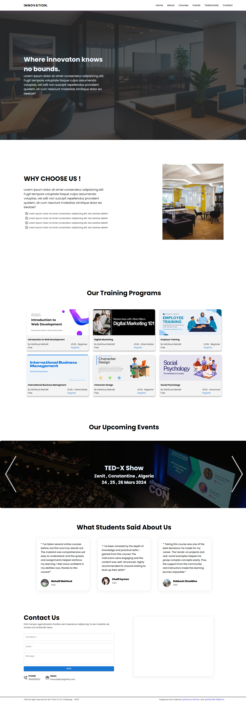

# Project Name

Welcome to our project! This is a brief overview of what the project is about and how to get started.

## Introduction

Innovate Hub is an innovative online platform dedicated to nurturing creativity and skill development. Our primary focus lies in offering cutting-edge training programs and organizing engaging events to inspire and empower individuals across various domains.

## Installation

To get started with this project, follow these steps:

1. Clone the repository to your local machine using the following command:

   ```
   git clone https://github.com/mahfoud-mehalli/innovation-hub.git ./innovate-hub-team6
   ```

2. Navigate into the project directory:

   ```
   cd innovate-hub-team6
   ```

3. Install the project dependencies using npm:

   ```
   npm install
   ```

## Usage

Once you've cloned the repository and installed the dependencies, you can run the project using the following command:

```
npm start
```

## Technologies used


## Software used


## Screenshot Of The Website



## Contact

If you have any questions or need further assistance, feel free to contact us at [mahfoudmehalli12345@gmail.com].
